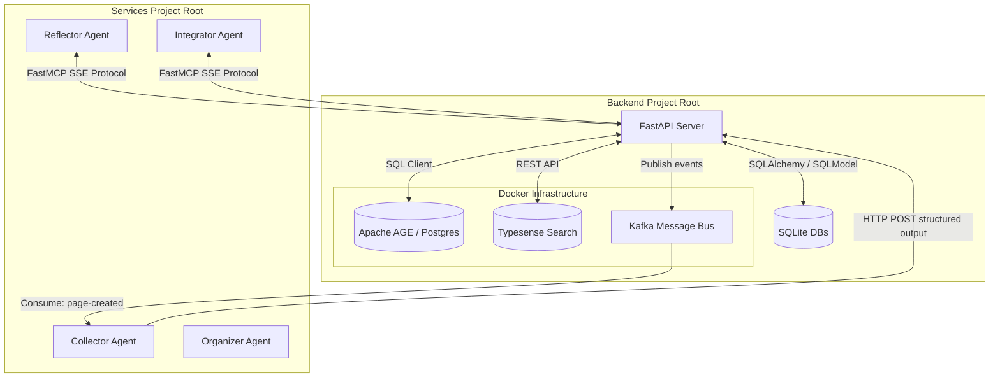

# Sibling-Service Agentic Integration Architecture (Apache AGE Edition)

This document describes the interface pattern between the autonomous agents in the `services` project and the core database and container infrastructure in the `backend` project. 

Due to the physical separation of these two projects (different workspace roots, separate virtual environments, and distinct dependencies), direct code sharing or database imports are avoided. Instead, a **Hybrid Network Interface** is used.

---

## 🏗️ Architectural Concept



The system uses three communication boundaries optimized for different agent roles:

1. **Kafka (Asynchronous Pipelines)**: Best for the **Collector Agent** & **Organizer Agent**. When a web page is added/modified, an event is emitted. The agents consume it and run heavy local processing (NLP/Ollama) asynchronously.
2. **FastAPI REST POST (Strict Write Verification)**: All write operations to databases (SQLite, Typesense updates) from the agents are processed through Pydantic endpoints in the FastAPI backend. This ensures validation and keeps the data models unified in one repository.
3. **FastMCP over SSE (Dynamic LLM Tool Use)**: Best for the **Reflector Agent** & **Integrator Agent**. Rather than hardcoding APIs, the backend exposes SQLite, Apache AGE (Cypher), and Typesense (Vector search) queries as **MCP Tools**. The agents connect as clients over Server-Sent Events (SSE) and let the LLM dynamically call these tools.

---

## 💻 Technical Blueprints

### 1. FastMCP Server Bridge (`backend/api/mcp_router.py`)
Expose tools from the backend project so that the agent project doesn't need to install `psycopg2` or SQL configurations.

```python
# backend/api/mcp_router.py
from fastapi import APIRouter
from mcp.server.fastmcp import FastMCP
import psycopg2
import httpx

# Create a FastMCP instance
mcp = FastMCP("backend-tools")

@mcp.tool()
def query_knowledge_graph(cypher_query: str) -> str:
    """
    Execute an openCypher query on Apache AGE to fetch concept relations.
    The query must be a standard Cypher query string (e.g. 'MATCH (n:Concept) RETURN n.name').
    """
    conn = psycopg2.connect(
        host="localhost",
        port="5435",
        database="graphdb",
        user="postgres",
        password="local_rag_secret_key_123"
    )
    conn.autocommit = True
    relations = []
    
    # Apache AGE wraps Cypher inside SELECT * FROM cypher() AS (...)
    sql_query = f"""
    SELECT * FROM cypher('concept_graph', $$
        {cypher_query}
    $$) as (source agtype, relation agtype, target agtype);
    """
    
    with conn.cursor() as cursor:
        # Load AGE search path
        cursor.execute("LOAD 'age';")
        cursor.execute("SET search_path = ag_catalog, '$user', public;")
        
        cursor.execute(sql_query)
        for record in cursor.fetchall():
            relations.append(str(record))
            
    conn.close()
    return str(relations)

@mcp.tool()
async def search_concepts(query: str, limit: int = 5) -> str:
    """
    Search Typesense for semantically similar pages, concepts, or keywords.
    """
    async with httpx.AsyncClient() as client:
        response = await client.post(
            "http://localhost:8108/collections/pages/documents/search",
            headers={"X-TYPESENSE-API-KEY": "local_rag_secret_key_123"},
            json={"q": query, "query_by": "content", "per_page": limit}
        )
        return response.text
```

---

### 2. FastMCP SSE Client (`services/services/Agents/IntegratorAgent/agent.py`)
Pydantic-AI and LangGraph agents inside the `services` project connect to the backend as MCP clients to dynamically query data.

```python
# services/services/Agents/IntegratorAgent/agent.py
import asyncio
from pydantic_ai import Agent
from mcp import ClientSession
from mcp.client.sse import sse_client

async def run_integrator_agent(prompt: str):
    # Connect to the FastMCP server exposed by the backend
    async with sse_client("http://localhost:8090/mcp/sse") as (read, write):
        async with ClientSession(read, write) as session:
            # Initialize connection and fetch available tools
            await session.initialize()
            mcp_tools = await session.list_tools()
            
            # Map MCP tools into the Agent's context
            agent = Agent(
                'ollama:granite4.1:3b',
                system_prompt="You are the Integrator. Resolve inconsistencies in the knowledge base."
            )
            
            # The agent can now call `query_knowledge_graph` or `search_concepts` 
            # dynamically without having psycopg2 or db configurations installed locally.
            response = await agent.run(prompt, deps=session)
            print(response.data)
```

---

### 3. Kafka Consumer & POST Worker (`services/services/Agents/CollectorAgent/collector_agent.py`)
Background worker pipeline that consumes scraping events, performs local lemmatization/processing, and POSTs structured output back to the backend.

```python
# services/services/Agents/CollectorAgent/collector_agent.py
import json
import httpx
from kafka import KafkaConsumer
from pydantic import BaseModel, Field

class LemmaMatrixPayload(BaseModel):
    page_id: int
    words: list[str] = Field(..., description="Extracted lemma list")
    language: str = Field("tr", description="Detected page language")
    keywords: list[str] = Field(default_factory=list, description="Top keyword descriptors")

def process_page_content(text: str) -> list[str]:
    # Custom local parsing logic (e.g. Spacy Lemmatizer, NLTK)
    # returns lemma words
    return [token.lower() for token in text.split() if len(token) > 2]

def start_collector_pipeline():
    consumer = KafkaConsumer(
        'page-created',
        bootstrap_servers=['localhost:9092'],
        auto_offset_reset='earliest',
        value_deserializer=lambda m: json.loads(m.decode('utf-8'))
    )
    
    print("Collector agent pipeline listening on 'page-created'...")
    for message in consumer:
        event = message.value
        page_id = event.get("id")
        content = event.get("content")
        
        # 1. Local execution
        lemmas = process_page_content(content)
        
        # 2. Package output as Pydantic model
        payload = LemmaMatrixPayload(
            page_id=page_id,
            words=lemmas,
            language="tr"
        )
        
        # 3. HTTP POST structured output back to FastAPI
        try:
            with httpx.Client() as client:
                res = client.post(
                    "http://localhost:8090/api/lemma_matrix/update",
                    json=payload.model_dump()
                )
                print(f"Uploaded lemmas for page {page_id}. Response: {res.status_code}")
        except httpx.HTTPError as err:
            print(f"Error connecting to backend API: {err}")

if __name__ == "__main__":
    start_collector_pipeline()
```

---

## 🎯 Architecture Benefits

* **Strict Boundary Separation**: The `services` project handles LLM prompting, agent state machine execution (LangGraph), and text processing. The `backend` project handles database migrations, transactional guarantees, search index configurations, and container startup.
* **Token Efficiency**: Agents only retrieve the specific context they need via MCP read tools, rather than parsing raw databases or dumping entire files.
* **Failure Safety**: Slow or crashed agents will not halt the core API web servers, as communication goes through asynchronous Kafka topics.
